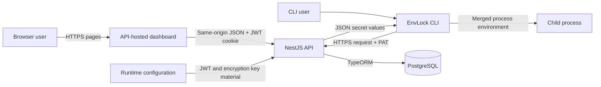
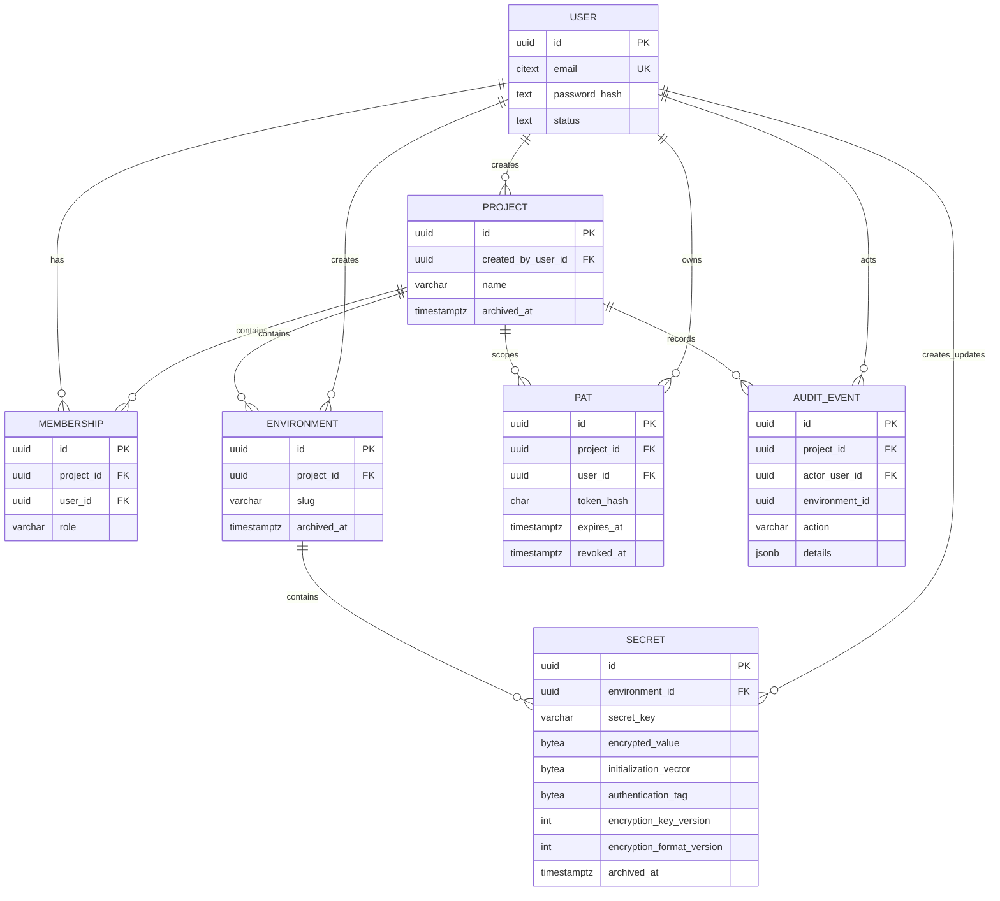
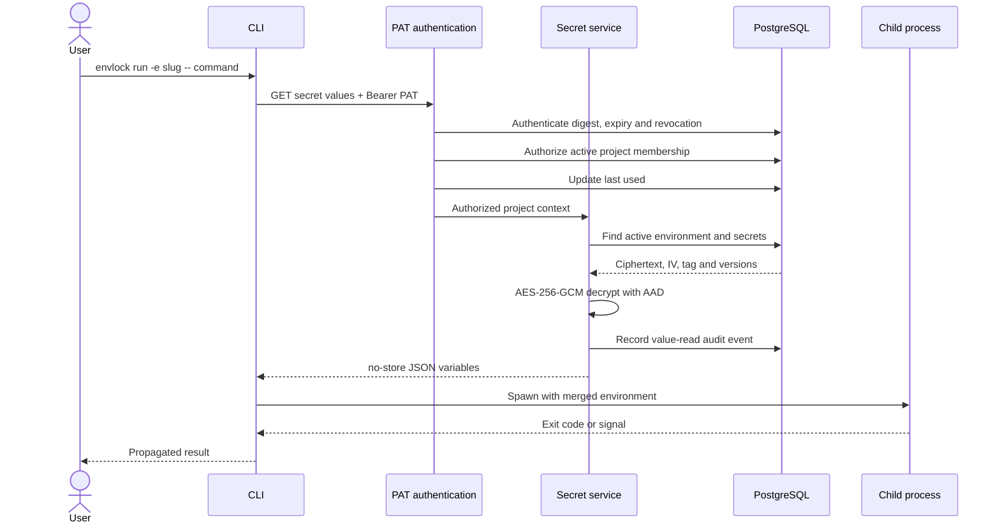

# EnvLock: Design, Architecture and Testing Report

## 1. Project Overview and Scope

### 1.1 Problem Statement

Software teams need credentials, connection strings and service keys to run applications locally.
Distribution through chat or email produces copies that are difficult to inventory and revoke when
access changes. Committing a `.env` file creates a more durable disclosure because repository
history, forks, build systems and workstations may retain it after deletion. An untracked file avoids
source-control exposure but still leaves persistent plaintext whose permissions, backup behavior and
lifecycle depend on each host.

EnvLock centralizes project secrets, encrypts stored values, controls access through project
membership and retrieves values when a command is launched. Runtime retrieval avoids an EnvLock-
managed plaintext file; it does not remove plaintext from API and CLI memory or the child process
environment.

### 1.2 Project Objectives

The implemented system has the following objectives:

- Encrypt secret values using authenticated encryption and exclude plaintext from normal metadata responses.
- Organize access around projects and named environments.
- Provide server-enforced role-based access control (RBAC) for owners, maintainers and developers.
- Issue project-scoped personal access tokens (PATs) for non-browser access.
- Retrieve an environment's secrets through a command-line client and inject them into a child
  process at runtime.
- Compare expected keys in `.env.example` with stored keys without retrieving values.
- Record security-relevant project, membership, environment, secret, PAT and CLI-read events.
- Package the API, dashboard and CLI in a maintainable, testable repository with repeatable build,
  migration and deployment configuration.

### 1.3 Users and Roles

An **owner** creates and governs a project. The owner controls project metadata and archival,
membership and role assignments, and all environment and secret management. The implementation
creates one owner membership with a new project and does not expose ownership transfer or additional
owner assignment.

A **maintainer** administers environments and secrets, reviews audit events, and can manage PATs
beyond their own. A maintainer cannot alter the project itself or its membership. A **developer** can
read project, environment and secret metadata and can create and use a personal project token. This
allows runtime retrieval while preventing secret modification through the dashboard API.

The dashboard hides controls that do not apply to the current role, but these UI decisions are not
the security control. Services independently enforce membership and role requirements.

| Capability                                         | Owner | Maintainer | Developer |
| -------------------------------------------------- | :---: | :--------: | :-------: |
| Read active project and environment metadata       |  Yes  |    Yes     |    Yes    |
| Update or archive the project                      |  Yes  |     No     |    No     |
| List project members                               |  Yes  |    Yes     |    Yes    |
| Add, change or remove maintainer/developer members |  Yes  |     No     |    No     |
| Create, update or archive environments             |  Yes  |    Yes     |    No     |
| Read secret metadata                               |  Yes  |    Yes     |    Yes    |
| Create, replace, rename or archive secrets         |  Yes  |    Yes     |    No     |
| View project audit events                          |  Yes  |    Yes     |    No     |
| Create and use an own project PAT                  |  Yes  |    Yes     |    Yes    |
| List or revoke any project PAT                     |  Yes  |    Yes     |    No     |
| List or revoke an own PAT                          |  Yes  |    Yes     |    Yes    |

### 1.4 Scope and Exclusions

The MVP includes account registration and login, project membership, RBAC,
environment organization, encrypted secret persistence, static browser management pages, PAT
creation and revocation, CLI retrieval and diagnostic modes, audit history, database health checking,
schema migration and a configured managed deployment.

The implementation is intentionally narrower than a general-purpose secrets platform. Excluded
capabilities include secret history and rollback, approval workflows, ownership transfer, restore
operations, fine-grained PAT scopes, workload identity, automatic rotation and advanced identity
management. Deployment-platform integration, cross-region availability and production operations
such as backup, monitoring and incident-response automation are also outside the MVP.

## 2. System Architecture

### 2.1 Architectural Style

EnvLock is an npm monorepo with API and CLI workspaces defined by the
[`root workspace configuration`](../package.json). Shared TypeScript, linting, formatting and test
tooling makes cross-component verification repeatable while each workspace retains its runtime
dependencies.

The API is a modular monolith assembled by the [`NestJS root module`](../api/src/app.module.ts).
Feature modules separate authentication, users, projects, environments, secrets, personal access
tokens, audit events and health, but compile and deploy as one Node process. Section 3.1 evaluates why
this deployment boundary is proportionate to the capstone.

Within features, a typical request follows:

`Controller -> Service -> Repository -> TypeORM Entity -> PostgreSQL`

Controllers define HTTP contracts and invoke validation. Services implement business rules,
authorization, encryption orchestration and audit creation. Repository wrappers centralize TypeORM
queries, active-record filtering and optional transaction managers. Entities describe persistence,
while a migration defines the production schema explicitly.

The implementation uses dependency injection, feature modules, repository abstraction, validation
contracts, authentication guards, centralized project authorization, soft archival, append-oriented
audit records and an encryption-key provider. Project creation transactionally creates the project,
initial owner membership and audit event. Most later mutations and audit writes are sequential, an
audit-reliability limitation considered in Section 4.5.

### 2.2 Major System Components and System Architecture Diagram

The **dashboard** is static HTML, CSS and native browser JavaScript served by the API process through
the [`frontend configuration`](../api/src/frontend/configure-frontend.ts). It uses same-origin JSON
requests and an HTTP-only JSON Web Token (JWT) cookie; it is not an independently hosted component.

The **NestJS API** owns authentication, authorization, validation, encryption, audit behavior and
persistence orchestration. Representative [`project`](../api/src/projects/projects.module.ts) and
[`secret`](../api/src/secrets/secrets.module.ts) modules show the feature boundary. PostgreSQL is the
durable system of record for identities, access relationships, encrypted values, token hashes and
audit events.

The **CLI** is a separately publishable npm package. It authenticates with a PAT, retrieves either
secret values or keys, and can run a child command. The API and CLI communicate over HTTP; HTTPS is
therefore an operational security requirement even though the CLI also permits HTTP for local use.

### 2.3 Application Layers and Patterns

**Controllers** expose resource routes, apply JWT or PAT guards, validate UUIDs and invoke Zod-backed
request validation. They contain little domain logic. The CLI secret controller also marks key and
value responses `Cache-Control: no-store`.

**Services** are the principal policy layer. The shared
[`ProjectAccessService`](../api/src/projects/project-access.service.ts) resolves active membership and
role requirements. Project services enforce owner-only changes; environment and secret services
allow owner-or-maintainer mutations. Secret identifiers are generated before encryption so they can
participate in authenticated data, and cryptographic failures produce a generic response.

**Repositories** wrap TypeORM operations. Active lookups exclude archived records, secret metadata
queries omit ciphertext columns, and transaction-aware methods can use an injected entity manager.
The testing implications of mocked TypeORM repositories are addressed in Section 6.

**Entities and migrations** provide complementary persistence definitions. The shared
[`entity registry`](../api/src/database/entities.ts) supports runtime mapping, while the
[`production migration`](../api/src/database/migrations/2026070900000-InitialSchema.ts) defines
extensions, tables, checks, indexes and foreign keys. Production schema synchronization is disabled;
non-production synchronization is enabled for convenience.

**Validation contracts** reject malformed bodies, roles, slugs, secret keys and expiration values.
Database constraints provide a second boundary for uniqueness, accepted roles, encryption metadata
sizes and foreign-key integrity. Runtime settings are checked by
[`environment configuration validation`](../api/src/config/environment.ts).

**Shared infrastructure** includes structured logging, Helmet security headers, a PostgreSQL
exception filter and database health checking. Known constraint failures become controlled client
responses; unexpected database failures are sanitized.

This allocation keeps transport concerns in controllers and business policy in services, while
repositories remain responsible for query shape and active-record filtering. The boundaries are
concrete rather than purely conceptual: services can be tested against controlled collaborators, and
transaction-aware repositories can participate in a shared TypeORM transaction when atomicity is
required.

### 2.4 Data Model and Entity-Relationship Diagram

The data model contains users, projects, project memberships, environments, secrets, PATs and audit
events, represented by TypeORM entities such as the
[`Secret entity`](../api/src/secrets/entities/secret.entity.ts). UUIDs identify records;
PostgreSQL `citext` provides case-insensitive email uniqueness and `pgcrypto` generates UUIDs.

Membership is the authorization join between users and projects, with a unique user-project pair and
one of three checked roles. Environments belong to projects. Active environment slugs are unique
within a project. Secrets belong to environments and active secret keys are unique within an
environment. Partial indexes allow a slug or key to be reused after archival.

Projects, environments and secrets use nullable archival timestamps. Archival retains child records
and ciphertext but active lookups make them inaccessible. Membership removal is a physical deletion;
PAT revocation records a timestamp. No restore operation is implemented.

PAT persistence is summarized here as part of the data model; its credential controls are evaluated
in Section 4.3. Audit events retain the project and actor, an optional environment identifier, action,
target and structured details. The environment identifier is indexed but is not a foreign key.

Foreign-key deletion behavior also reflects record purpose. Project children generally cascade if a
project is physically removed, while user references commonly restrict deletion so ownership and
actor identity remain valid. The API normally archives projects rather than deleting them, preserving
their relational context. These database rules complement, rather than replace, active-resource
checks in the service layer.

The component and persistence boundaries establish the choices evaluated next: deployment remains
coarse-grained, while authorization, encryption and runtime retrieval receive narrower application
boundaries because they carry the principal confidentiality and access risks.

## 3. Key Design Decisions and Trade-offs

| Decision                  | Chosen approach and benefit                                                         | Alternative                      | Main trade-off                              |
| ------------------------- | ----------------------------------------------------------------------------------- | -------------------------------- | ------------------------------------------- |
| Modular monolith          | Feature modules in one service keep policy and transactions local                   | Distributed services             | Shared scaling and failure boundary         |
| PostgreSQL                | TypeORM plus an explicit migration provides relational constraints and transactions | Document database                | Database operation and migration discipline |
| Static dashboard          | API-hosted native web assets provide one same-origin deployment                     | Separate single-page application | Less frontend abstraction                   |
| PAT authentication        | A project bearer credential separates CLI access from browser sessions              | JWT reuse or OAuth device flow   | Broad project read scope                    |
| Authenticated encryption  | AES-256-GCM protects stored value confidentiality and integrity                     | Database-only encryption         | API must hold the decryption key            |
| Runtime injection         | Child-process environment avoids an EnvLock-managed plaintext file                  | Temporary file or language SDK   | Runtime plaintext exposure                  |
| Centralized authorization | Shared membership and role checks produce consistent RBAC                           | Per-controller policy            | Each service must invoke the policy         |

### 3.1 Modular Monolith

The modular monolith balances separation with operational economy. Explicit feature boundaries keep
authorization and persistence calls in-process, simplify policy tests and permit related writes to
share a transaction. Independently deployed services would allow separate scaling but introduce
distributed authentication, network failure and transaction concerns disproportionate to the current
system.

### 3.2 PostgreSQL Persistence

PostgreSQL supports relational integrity and specialized constraints. Partial unique indexes express
uniqueness for active environments and secrets, `citext` enforces case-insensitive email uniqueness,
and JSONB stores audit details. A document database could reduce schema ceremony but would shift
membership, uniqueness and relationship enforcement into application code.

### 3.3 Static Dashboard

Serving static assets from the API provides one same-origin deployment and permits an HTTP-only
session cookie rather than browser JavaScript token storage. A separate single-page application would
provide richer component tooling and independent releases, but add a build, hosting and cross-origin
surface. The simpler approach is proportionate to the dashboard's limited screens.

### 3.4 Personal Access Token Authentication

The CLI requires a non-interactive credential distinct from browser sessions. A project PAT provides
that boundary without reusing account passwords or JWTs. An OAuth device flow could issue shorter-
lived access but would require an authorization-server workflow. The PAT is deliberately simple for
the capstone, although its project-wide read capability limits least privilege.

### 3.5 Authenticated Secret Encryption

Authenticated encryption was selected so stored-value modification is detected as well as concealed.
Database-managed encryption would simplify application code but place key use near the persistence
boundary; envelope encryption would improve key custody at additional operational cost. Section 4.2
describes the implemented AES-256-GCM control and its key boundary.

### 3.6 Runtime Environment Injection

The [`CLI process execution`](../packages/cli/src/cli.ts) retrieves values before process creation and
merges them over the parent environment. This supports existing applications without SDK integration
or an EnvLock-managed plaintext file. Plaintext remains in transit and memory and is available to the
child and descendants.

### 3.7 Centralized Authorization

Centralized project authorization resolves active membership and asserts roles. Inaccessible or
archived projects generally produce a not-found response, reducing project-existence disclosure. A
declarative policy framework could make enforcement more visible at routes, but the current service
keeps a small policy model explicit and testable. New service methods must invoke it consistently.

## 4. Security Design

### 4.1 Authentication and Authorization

Registration normalizes email addresses and requires at least 12-character passwords, which the
[`password hasher`](../api/src/auth/password/password-hasher.ts) processes with Argon2 defaults.
Plaintext passwords are not persisted. Custom cost parameters, password reset, multi-factor
authentication and request throttling are outside the implemented account model.

Successful login creates a signed JWT containing the user identifier and selected attributes. The
dashboard receives it in an HTTP-only, `SameSite=Strict` cookie, marked `Secure` in production; the
response also contains the token. The [`JWT guard`](../api/src/auth/guards/jwt-auth.guard.ts) accepts
a bearer header or that cookie. Logout clears the cookie but cannot revoke a copied stateless JWT.

RBAC follows active project membership. Owners govern project and membership state; owners and
maintainers govern environments and secrets; all members can read secret metadata and use their own
PATs. Active lookups exclude archived resources. Dashboard restrictions mirror but do not replace
these service-level checks.

### 4.2 Secret Encryption

The [`secret encryption service`](../api/src/secrets/encryption/secret-encryption.service.ts) uses
AES-256-GCM. Each operation generates a cryptographically random 12-byte initialization vector (IV)
and stores a 16-byte authentication tag. The configured Base64 key must decode to 32 bytes, its
version must be positive, and the encryption format is version 1.

Additional authenticated data (AAD) has the logical form
`envlock:secret:v1:<secret-id>:<environment-id>`. It is authenticated but not encrypted. This binds a
ciphertext to both its record and environment; changing the ciphertext, tag, IV or context causes
decryption to fail. Cryptographic failures are collapsed into a generic application error.

Encryption at rest protects values when application tables or backups are obtained without the
runtime key. Secret names, identifiers, users, timestamps and audit metadata remain visible. The
control also ends at the trusted API decryption point: compromise of the API, or of both database and
key, exposes plaintext.

Although records store key versions, the current provider loads one key and rejects other versions.
Changing it without retaining old keys or re-encrypting data would make existing records unreadable.
Key-version metadata supports identification; it is not an implemented rotation mechanism.

### 4.3 Personal Access Token Security

The [`PAT service`](../api/src/personal-access-tokens/personal-access-tokens.service.ts) creates a
visible token identifier and 32 random bytes encoded as a URL-safe secret. The raw PAT appears only in
the creation response. Persistence retains the identifier, SHA-256 digest of the secret, final four
characters and lifecycle metadata; later listings omit the raw value and digest.

PATs belong to one user and project. Creation requires active membership and an expiry within 90 days.
The [`PAT authentication service`](../api/src/auth/personal-access-token-auth.service.ts) parses the
bearer credential, verifies its digest, expiration and revocation, confirms active project membership,
then updates the last-used timestamp. Membership removal or project archival therefore blocks use
without altering the PAT row.

The authentication path does not check disabled-user status, and PATs have no environment or action
scope. A stolen PAT retains its owner's CLI read capability until expiration, revocation, membership
removal or project archival. For this capstone, expiration and revocation provide a practical
lifecycle, while narrower scopes and immediate user-status invalidation remain future improvements.

### 4.4 Runtime Secret Retrieval and Sequence Diagram

The `run` command resolves flags and `ENVLOCK_*` variables, validates the API URL and environment slug,
and requires a command after `--`. It sends the PAT to the runtime secret retrieval endpoint. PAT
authentication validates credential state; membership provides authorization; the secret service
then resolves the active environment and decrypts active records. A value-read audit event records
the actor, PAT, environment and count without values. The response uses `Cache-Control: no-store`.

The CLI validates the string-valued map, overlays it on the parent process environment and starts the
child with inherited standard streams. Unix execution avoids a shell; Windows enables one. Exit codes
are returned and termination signals propagated.

### 4.5 Threats, Trust Boundaries and Limitations

The principal assets are plaintext values, encryption and JWT keys, passwords, PATs, authorization
relationships and audit history. Trust boundaries occur between clients and API, API and PostgreSQL,
runtime configuration and API, and CLI and child process.

The implemented controls address the capstone's central threat: unauthorized disclosure from common
distribution and storage practices. They reduce exposure at rest and enforce project access, while
deliberately trusting the running API and authorized child process. The following limitations define
that trust rather than negate the controls.

- **Decryption and runtime:** the API must hold the key and is trusted to decrypt. Plaintext then
  exists in API and CLI memory and the child environment, where authorized code or host-level
  inspection can expose it.
- **Transport:** PATs and values cross the network. HTTP supports local development; other networks
  require correctly validated transport layer security (TLS).
- **Credentials and configuration:** hashing limits disclosure from PAT persistence, but a stolen raw
  bearer credential is directly usable. The API's configured encryption key is similarly a trust
  anchor.
- **Database compromise:** database-only compromise exposes identities, membership, secret names,
  ciphertext, PAT metadata and hashes, and modifiable audit rows. It should not alone disclose secret
  values, but combined database and key compromise does.
- **Auditability:** mutations and CLI value reads are recorded without values. Key-only diagnostic
  reads, login/logout, authentication failures and PAT failures are not audited. Records share the
  application database and are not tamper-evident. Because most mutations and audit writes are not
  atomic, an audit failure may follow a committed mutation.

## 5. Deployment Architecture

### 5.1 Continuous Integration and Deployment Configuration

The [`GitHub Actions workflow`](../.github/workflows/ci.yml) defines continuous integration (CI) for
pull requests, pushes to the main branch and manual dispatch. Lint runs first; API and CLI tests then
run independently using Node 22 and locked dependencies. The workflow has read-only repository
permission.

These gates detect static-analysis failures and covered regressions. Formatting, builds, migrations,
PostgreSQL, browser behavior and deployment smoke tests are outside the workflow. No deployment job
is defined, so the repository demonstrates CI rather than continuous deployment (CD).

The [`Render deployment configuration`](../render.yaml) defines one Node web service and a managed
PostgreSQL database. The service installs dependencies, builds the API and runs pending migrations
before startup, so migration failure prevents launch. Render supplies the database connection; JWT
and encryption secrets remain external to source control. The `/health` check tests database
connectivity and returns a sanitized HTTP 503 response on dependency failure.

For a capstone-scale service, this arrangement provides a reproducible deployment without requiring
the project to operate hosts or a database server. Its limited automation is acceptable for the
demonstrated scope, provided the distinction between configured deployment and verified operational
reliability remains explicit.

### 5.2 Deployment Alternatives and Cost Implications

| Model                        | Operational responsibility                                                             | Relative cost and trade-off                                                        |
| ---------------------------- | -------------------------------------------------------------------------------------- | ---------------------------------------------------------------------------------- |
| Current Render configuration | Provider hosts Node and PostgreSQL; project manages application secrets and migrations | Low entry cost and administration; limited free-tier resources and assurances      |
| Managed production cloud     | Provider offers durable data, key services, monitoring and scalable compute            | Higher service cost; lower infrastructure burden and stronger availability options |
| Self-hosted or on-premises   | Team owns hosts, patching, TLS, databases, backups, networking and monitoring          | May use existing infrastructure; highest staffing and operational burden           |

No verified cost totals are stored in the repository, so the comparison is qualitative. Actual cost
depends on load, retention, availability, support and organizational labor rather than compute alone.

### 5.3 Operational Considerations

Implemented operational controls include production migrations, structured JSON logging,
database-backed audit events, startup configuration validation and a database health check. The
health endpoint does not assess encryption, migration currency or infrastructure capacity, and the
repository configures no metrics, tracing or alerting.

Production recommendations are automated backups and restore drills, migration recovery procedures,
service and database monitoring, alerting and controlled log retention. Key rotation additionally
requires a versioned key ring and re-encryption process. These recommendations extend the MVP rather
than describe current capabilities; Section 7.4 prioritizes them.

## 6. Testing

### 6.1 Testing Strategy

The test strategy concentrates on unauthorized access, incorrect RBAC, plaintext persistence,
cryptographic tampering, invalid credentials, malformed HTTP input and CLI process behavior. Unit
tests isolate policy branches; controller tests add NestJS routing, guards, validation and HTTP
responses while usually mocking services. A smaller integration-style layer exercises static HTTP
serving, health behavior, temporary files and real child processes. This distribution gives useful
failure localization, with system-boundary gaps identified in Sections 6.3 and 6.8.

The selected levels match the dominant implementation risks. Authorization and encryption contain
many deterministic branches suited to isolated tests, whereas CLI correctness depends on filesystem
and subprocess behavior and therefore benefits from real local boundaries. The strategy favors
behavioral evidence over test count; the reported totals describe the executed suite, not an
independent measure of quality.

### 6.2 Unit Testing

Unit tests cover configuration and request validation, JWT and PAT guards, password authentication,
authorization services, encryption, PostgreSQL error mapping and TypeORM options. The
[`encryption suite`](../api/src/__test__/secrets/secret-encryption.service.spec.ts) verifies randomized
output, IV and tag dimensions, AAD binding and generic decryption failures. Service suites verify role
policy and transactional project creation.

Repository tests use mocked TypeORM repositories and entity managers to verify active filters,
selected columns, ordering, transaction repository selection and persistence calls. They test query
construction, not PostgreSQL execution.

### 6.3 Integration and API Testing

Several controller suites create NestJS HTTP applications and issue requests to verify authentication,
UUID and body validation, status codes, cookies and response shaping. Their services are mocked, so
these are controller/framework-boundary tests rather than full integration tests.

Static frontend tests use real Express/NestJS middleware and files. Health tests combine the real
controller and service but mock the database query. No suite provisions PostgreSQL, applies the
migration and exercises repositories against it; no end-to-end (E2E) suite runs the owner-to-CLI
workflow. These omissions limit confidence in SQL, dependency wiring and complete-system behavior,
while remaining proportionate to a test strategy centered on application policy.

### 6.4 CLI Testing

The [`CLI suite`](../packages/cli/src/__test__/cli.spec.ts) covers command parsing, configuration
precedence, URL and slug validation, API requests, help and version output. Doctor mode parses real
temporary `.env.example` files and reports missing or extra keys.

Run-mode tests mock `fetch` but launch real child processes, verifying value injection, malformed
payloads, authentication and server errors, startup failure and exit-code propagation. They call the
CLI function rather than the packaged executable and make no live API request; this is integration-
style process testing, not system E2E testing.

### 6.5 Security-Focused Testing

Representative security evidence includes:

- AES-256-GCM round trips, tampered ciphertext, tags and IVs, changed AAD context, unsupported versions
  and non-disclosing errors.
- Prevention of plaintext repository writes and exclusion of encrypted fields from secret metadata,
  covered by the [`secret service suite`](../api/src/__test__/secrets/secrets.service.spec.ts).
- Owner, maintainer and developer restrictions for project, membership, environment, secret, PAT and
  audit operations, including cross-project and archived-resource concealment.
- Malformed, unknown, expired and revoked PATs and rejection after membership removal, covered by the
  [`PAT authentication suite`](../api/src/__test__/auth/personal-access-token-auth.guard.spec.ts).
- PAT creation responses that expose the raw credential once, with later responses excluding raw and
  hashed token material.
- `Cache-Control: no-store` on CLI key and value responses and a key-only doctor response.
- Controlled PostgreSQL and health errors that omit underlying exception details.
- Authentication requirements, strict DTO validation and security headers at tested HTTP boundaries.

Disabled-user invalidation is not asserted because the authentication paths do not currently provide
immediate invalidation. External security assessment is outside the automated test scope.

### 6.6 Manual and Deployment Verification

A reproducible manual verification should use non-production credentials and disposable secret
values:

1. Request `/` and confirm redirection to the login dashboard, then request `/health` and confirm an
   HTTP 200 response with API and database status `ok`.
2. Register and log in as an owner, create a project and environment, and add a test secret. Confirm
   later dashboard listings show its key and metadata but not its value.
3. Register a second user, add that user as a developer and confirm write controls are absent and API
   write attempts are forbidden.
4. Create a developer PAT and save the one-time value securely. Run `envlock doctor` against an
   `.env.example` file and confirm only key differences are displayed.
5. Run a harmless child command through `envlock run` that verifies the expected variable is present
   without printing its value. Confirm the child exit status is propagated.
6. Review the audit page as owner or maintainer and confirm the CLI value-read event appears without
   plaintext. Revoke the PAT and confirm a subsequent CLI request is rejected.

This procedure was executed on 12 July 2026, and all manual checks passed.

| Manual check                           | Result | Date         |
| -------------------------------------- | ------ | ------------ |
| Owner project and environment creation | Passed | 12 July 2026 |
| Developer authorization restrictions   | Passed | 12 July 2026 |
| CLI doctor key comparison              | Passed | 12 July 2026 |
| CLI runtime injection                  | Passed | 12 July 2026 |
| PAT revocation                         | Passed | 12 July 2026 |
| Audit-event creation                   | Passed | 12 July 2026 |

### 6.7 Test Coverage

| Component | Coverage command            | Suites | Tests | Statements | Branches | Functions |  Lines | Result |
| --------- | --------------------------- | -----: | ----: | ---------: | -------: | --------: | -----: | ------ |
| API       | `npm run test-coverage:api` |     31 |   272 |     82.80% |   80.03% |    84.00% | 83.16% | Pass   |
| CLI       | `npm run test-coverage:cli` |      1 |    27 |     92.46% |   88.17% |    90.90% | 92.27% | Pass   |

Both workspaces exceed the project’s 80% coverage target across statements, branches, functions and lines.

### 6.8 Testing Limitations

The main evidence gaps are PostgreSQL and migration integration tests, complete API-to-CLI E2E tests,
browser automation and CI deployment smoke tests. Load, concurrency and fault behavior are also
unmeasured. In particular, mocked repositories cannot reveal SQL dialect, transaction or
serialization failures. For the capstone, detailed policy and cryptographic tests provide a strong
application-layer base; production use would require broader system and operational evidence.

## 7. Evaluation and Conclusion

### 7.1 Objectives Achieved

EnvLock meets the core capstone objectives: authenticated encryption before persistence, secret
metadata responses without values, project and environment RBAC, project PATs, runtime secret
retrieval, key-only diagnostics and audit events for important mutations and value reads. These
capabilities reduce uncontrolled distribution while preserving the explicit runtime trust boundary
evaluated in Section 4.

### 7.2 Architectural Evaluation

The modular monolith is proportionate to the intended scale. Feature and layer boundaries support
maintenance and policy testing, while one deployment and database limit operational complexity.
Relational constraints, authenticated encryption and centralized project authorization address the
highest-risk data and access requirements without service decomposition.

Locked dependencies, workspace builds, migrations, health checking and Render configuration support
deployability. Test confidence is strongest at the policy and cryptographic layers and weakest at PostgreSQL, browser and deployed-system boundaries.

### 7.3 Project Limitations

The principal product limitations are broad PAT read access, limited identity lifecycle and no secret
history. Engineering constraints center on credential invalidation, the single active encryption key,
non-atomic audit writes and incomplete system-level test and operational evidence. These limits do not
undermine the implemented MVP, but they define the work required before supporting higher-assurance
or larger-scale use.

### 7.4 Future Improvements

1. Introduce envelope encryption backed by managed or hardware-backed key storage, with a key ring,
   staged rotation, re-encryption and tested recovery.
2. Add environment- and operation-scoped, shorter-lived credentials; consider an OAuth device flow or
   workload identity to reduce long-lived bearer-token exposure.
3. Add secret version history with controlled rollback, retention and permanent-deletion policy.
4. Add PostgreSQL migration and integration tests, packaged CLI-to-API E2E tests and browser
   automation, then include build, formatting and smoke checks in the delivery workflow.
5. Add metrics, alerting, authentication-abuse detection, backup/restore drills and recovery
   procedures.
6. Revalidate user status during JWT and PAT authentication and define explicit session/token
   invalidation semantics.

### 7.5 Conclusion

This submission documents the design, implementation and testing of EnvLock as an MVP for controlled
secret distribution. The submitted system uses a modular architecture, relational authorization,
authenticated encryption, separate browser and CLI authentication, runtime process integration and
auditing to address the project objectives. The document also identifies the boundaries of the
implemented scope and records further work in key management, identity lifecycle, operations and
system-level verification.
